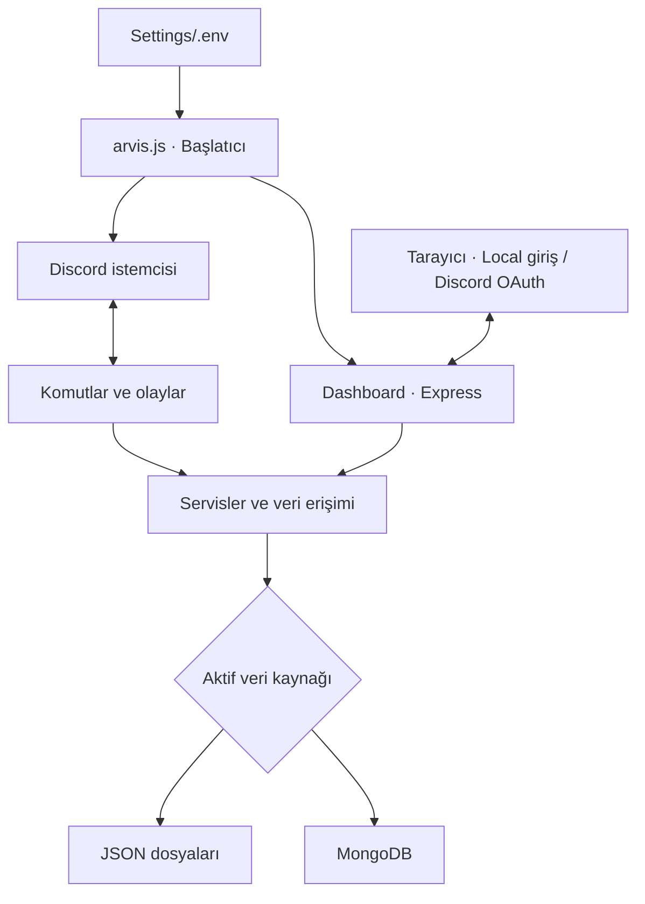

<div align="center">

# ALL In ONE

### Discord sunucunuz için tek merkezden yönetim

Moderasyon, otomasyon, topluluk araçları, müzik ve web yönetim paneli.<br>
**arviis.** tarafından geliştirilen, kendi ortamınızda çalıştırabileceğiniz çok amaçlı Discord botu.


[Hızlı başlangıç](#hizli-baslangic) · [Web paneli](#web-paneli) · [Veritabanı](#veritabani) · [Sorun giderme](#sorun-giderme)

</div>

---

> [!NOTE]
> Bot, web paneli ve veri katmanı aynı uygulamanın parçalarıdır. Dashboard isteğe bağlıdır, başlangıçta kapalıdır. Varsayılan JSON modu ile ayrı bir veritabanı sunucusu kurmadan başlayabilirsiniz.

## İçindekiler

- [Sistem neler sunuyor?](#ozellikler)
- [Çalışma yapısı](#mimari)
- [Gereksinimler](#gereksinimler)
- [Hızlı başlangıç](#hizli-baslangic)
- [Yapılandırma rehberi](#yapilandirma)
- [Web yönetim paneli](#web-paneli)
- [JSON ve MongoDB](#veritabani)
- [Yedekleme ve geri yükleme](#yedekleme)
- [Çalıştırma ve işletim](#calistirma)
- [Proje yapısı](#proje-yapisi)
- [Geliştirme ve kontroller](#gelistirme)
- [Sorun giderme](#sorun-giderme)
- [Katkı, güvenlik ve lisans](#katki)

<a id="ozellikler"></a>

## ✨ Sistem neler sunuyor?

ALL In ONE, sunucu yönetimini Discord slash komutları ve tarayıcı üzerinden erişilen bir panel ile bir araya getirir. Komutlar, olay dinleyicileri ve yardımcı servisler ayrı klasörlerde düzenlenmiştir, özelliklerin çoğu ilgili sunucu için yapılandırılır.

| Alan | Öne çıkan özellikler |
| :--- | :--- |
| **Güvenlik ve moderasyon** | Ban, kick, timeout, uyarılar, toplu rol işlemleri, kanal kilidi, mesaj temizleme, AutoMod, spam/raid korumaları, honeypot ve denetim kayıtları. |
| **Sunucu otomasyonu** | Karşılama ve uğurlama, otomatik rol, emoji rol, clan tag rol, durum rolü, kanal yönlendirme, otomatik thread, otomatik yayınlama ve yapışkan mesajlar. |
| **Topluluk ve üyelik** | Seviye ve XP, rol ödülleri, aktif üye seçimi, abonelik, yetkili başvuruları, destek talepleri, transkriptler, doğum günleri ve boost bildirimleri. |
| **Eğlence ve etkileşim** | Çekiliş, oylama, oyun kanalları, anonim sohbet, anı defteri, itiraf, zaman kapsülü, görsel kartlar ve rastgele iltifatlar. |
| **Ses ve müzik** | Şarkı arama/oynatma, sıra yönetimi, Spotify ve YouTube Music entegrasyonları, geçici ses odaları, botun ses bağlantısı ve sunucu sayaçları. |
| **Bildirimler ve zamanlama** | YouTube bildirimleri, haber/RSS akışı, zamanlanmış mesajlar, hatırlatıcılar ve günlük gönderimler. |
| **Web yönetimi** | Sunucu seçimi, genel bakış, modül arama ve filtreleme, ayar formları, yönetim işlemleri, profil/avatar düzenleme, açık/koyu görünüm ve 12 renk paleti. |
| **Veri ve yedekleme** | JSON veya MongoDB, açılışta veri aktarımı, bekleyen MongoDB yazılarının diskte saklanması, sunucu yedekleri ve zamanlanmış bot ZIP yedeği. |

<details>
<summary><strong>Komut kategorileri ve örnekler</strong></summary>

Mevcut kaynak ağacında **9 kategoride 97 komut dosyası** bulunur. Gerçekte yüklenen ve Discord'a kaydedilen komutlar başlangıç ekranında raporlanır. Sunucu içindeki güncel liste için `/yardım` komutunu kullanın.

| Kategori | Dosya sayısı | Örnek komutlar |
| :--- | ---: | :--- |
| Bildirim | 1 | `/youtube-alert` |
| Bilgi | 9 | `/yardım`, `/ping`, `/bot-bilgi`, `/hesap-bilgi` |
| Bot | 3 | `/bot-log`, `/ses-kanalı`, `/yardım-embed-düzenle` |
| Eğlence | 20 | `/şarkı`, `/çekiliş`, `/oylama-başlat`, `/zaman-kapsülü` |
| Kullanıcı | 17 | `/avatar`, `/seviye`, `/hatırlatıcı`, `/doğum-günü` |
| Kurulumlu | 12 | `/emoji-rol`, `/clan-tag-rol`, `/otomatik-thread`, `/süreli-mesaj` |
| Moderasyon | 17 | `/ban`, `/timeout`, `/automod`, `/honeypot` |
| Sunucu | 16 | `/giriş-çıkış`, `/destek-sistemi`, `/starboard`, `/seviye-sistemi` |
| Yedek | 2 | `/yedek-sistemi`, `/yedekten-kur` |

</details>

> [!TIP]
> İlk kurulumdan sonra `/yardım` ile özellikleri keşfedin. Kurulum gerektiren sistemlerde önce kanal ve rol seçimlerini tamamlayın, ardından özelliği bir test kanalında deneyin.

<a id="mimari"></a>

## 🧭 Çalışma yapısı



Açılışta ortam ayarları okunur, aynı klasörde ikinci bir süreç çalışmasını engelleyen kilit alınır ve veritabanı hazırlanır. Discord bağlantısının ardından uygulama emojileri alınır, slash komutları kaydedilir ve zamanlanmış işler başlatılır. Dashboard etkinse aynı Node.js sürecinde çalışır, ayrı bir frontend derleme adımı yoktur.

> [!IMPORTANT]
> Bazı ayarlar bot genelindedir. Örneğin bot durumu, bot sahibi, olay filtreleri ve bot ZIP yedekleme planı tüm kurulumu etkiler. Paneldeki kapsam ve açıklamaları kontrol ederek kaydedin.

<a id="gereksinimler"></a>

## 📋 Gereksinimler

| Gereksinim | Açıklama |
| :--- | :--- |
| **Node.js ve npm** | Kurulum için **22.13 veya üzeri bir 22.x sürümü** kullanın. Bu sürüm aralığı ses bağımlılığının ve ESLint'in gereksinimlerini birlikte karşılar. |
| **Discord uygulaması** | Bir bot token'ı, botun ekleneceği bir sunucu ve gerekli Discord izinleri. |
| **Dosya erişimi** | Uygulamanın `Settings/` ve `Database/` altında okuma/yazma yapabilmesi gerekir. |
| **Ağ erişimi** | Discord'a ve kullanacağınız medya/API servislerine erişim gerekir. |
| **MongoDB — isteğe bağlı** | Yalnızca MongoDB modu seçilirse erişilebilir bir MongoDB bağlantısı gerekir. |
| **Alan adı ve HTTPS — public panel için** | Aynı makinede çalışan bir HTTPS ters vekil ve Discord OAuth yapılandırması gerekir. |

> [!NOTE]
> `canvas`, `sodium-native`, `ffmpeg-static` ve Puppeteer gibi bağımlılıklar yerel bileşenler veya ek indirmeler kullanabilir. Normal kurulumda `npm ci` çalıştırın. CI'daki `--ignore-scripts` seçeneği yalnızca lint işinin kurulumudur, çalışan bot kurulumu için aynı seçenek kullanılmamalıdır.

<a id="hizli-baslangic"></a>

## 🚀 Hızlı başlangıç

### 1. Projeyi hazırlayın

Depoyu klonlayın veya kaynak arşivini çıkarın. `package.json` dosyasının bulunduğu proje kökünde bir terminal açın:

```bash
node --version
npm --version
npm ci
```

### 2. Discord uygulamasını ayarlayın

Discord Developer Portal üzerinden uygulamanızın botunu hazırlayın:

1. Bot token'ını alın, bir sonraki adımda `DISCORD_TOKEN` alanına yazın.
2. Bot ayarlarında **Server Members Intent**, **Presence Intent** ve **Message Content Intent** erişimlerini etkinleştirin. İstemci bu intent'leri talep eder, uygulamanız için onay gerekiyorsa Discord tarafındaki işlemi de tamamlayın.
3. Sunucuya eklerken `bot` ve `applications.commands` kapsamlarını kullanın.
4. Kullanacağınız sistemlerin ihtiyaç duyduğu izinleri verin. Mesaj, rol, kanal, webhook ve ses işlemlerinin gereksinimleri farklıdır.
5. Botun rolünü, yönetmesini istediğiniz rollerin üzerine yerleştirin.

> [!WARNING]
> Token, botunuza erişim sağlayan gizli bilgidir. README'ye, ekran görüntülerine veya Git geçmişine eklemeyin. Paylaşıldıysa Discord tarafında yenileyin ve yerel ayarı güncelleyin.

### 3. Ortam dosyasını oluşturun

Henüz yoksa `Settings/.env.example` dosyasını `Settings/.env` olarak kopyalayın. Mevcut `.env` dosyanız varsa onu düzenleyin.

**Windows / PowerShell**

```powershell
if (-not (Test-Path -LiteralPath Settings/.env)) {
    Copy-Item -LiteralPath Settings/.env.example -Destination Settings/.env
}
```

**Linux / macOS**

```bash
test -f Settings/.env || cp Settings/.env.example Settings/.env
```

Başlangıç için ilgili alanları şu şekilde düzenleyin. Örnek yer tutucuları kendi değerlerinizle değiştirin:

```dotenv
DISCORD_TOKEN=BURAYA_BOT_TOKENINIZ
BOT_STATUS=online
BOT_OWNER_ID=BURAYA_DISCORD_KULLANICI_IDNIZ
BLACKLIST_SERVER_IDS=
IGNORE_BOT_EVENTS=false

JSON_DB_ENABLED=true
MONGODB_ENABLED=false

DASHBOARD_ENABLED=false
```

> [!IMPORTANT]
> Ortam okuyucusu **satır sonundaki `# açıklama` metnini ayırmaz**. Açıklamaları ayrı satırlara yazın. Örnek dosyadaki `IGNORE_BOT_EVENTS` ve `BLACKLIST_SERVER_IDS` satırlarını yukarıdaki gibi düzenleyin. API alanlarındaki web adresleri de anahtar değildir, kullanmadığınız API alanlarını boş bırakın.

### 4. Botu başlatın

```bash
node arvis.js
```

Başlangıç ekranında veritabanı durumunu, olay ve komut yükleme sonuçlarını kontrol edin. Discord'da `/ping` ve `/yardım` komutlarını deneyin.

> [!NOTE]
> Slash komutları açılışta uygulama genelinde Discord'a kaydedilir. Ayrı bir komut dağıtım betiği çalıştırmanız gerekmez. Aynı token ile farklı kurulumlar çalıştırmak komut kayıtlarının birbirini değiştirmesine neden olabilir.

<a id="yapilandirma"></a>

## ⚙️ Yapılandırma rehberi

Genel ayarlar ve gizli bilgiler `Settings/.env` üzerinden okunur. Sunucuya özel modül ayarları komutlar veya Dashboard üzerinden yönetilir. Elle değiştirilen ortam ayarları için botu yeniden başlatın. Panelin **Genel bot ayarları** bölümü, desteklediği ayarları dosyaya kaydeder ve çalışan uygulamaya uygular.

### Bot ve olay ayarları

| Değişken | Varsayılan / gereklilik | İşlev |
| :--- | :--- | :--- |
| `DISCORD_TOKEN` | **Zorunlu** | Discord bot token'ı. |
| `BOT_STATUS` | `online` | `online`, `idle`, `dnd` veya `invisible`. |
| `BOT_OWNER_ID` | Sahibe özel işlemler için gerekli | Bot sahibinin Discord kullanıcı kimliği; sunucu veya uygulama kimliği değildir. |
| `BLACKLIST_SERVER_IDS` | Boş | Olayları yok sayılacak sunucu ID'leri, birden çok ID'yi virgülle ayırın. |
| `IGNORE_BOT_EVENTS` | `false` | `true` olduğunda bot hesaplarından geldiği belirlenen olayları genel filtrede yok sayar. Modüllerin kendi filtreleri ayrıca geçerlidir. |

<details>
<summary><strong>İsteğe bağlı API anahtarları</strong></summary>

Bu alanlar temel bot açılışı için zorunlu değildir, ilgili sorguların çalışması için gerçek servis anahtarları gerekir.

| Değişken | İlgili komut |
| :--- | :--- |
| `ABUSEIPDB_API_KEY` | `/ip-sorgu` |
| `IPINFO_TOKEN` | `/ip-sorgu` |
| `OPENWEATHER_API_KEY` | `/ip-sorgu` |
| `API_NINJAS_KEY` | `/domain-sorgu` |
| `SCREENSHOTMACHINE_KEY` | `/domain-sorgu` |

Medya ve dış servis kullanan özelliklerin çalışması, sağlayıcının erişimine ve hesabınızın kullanım sınırlarına da bağlıdır.

</details>

> [!TIP]
> İşletim sistemi veya süreç yöneticisi tarafından önceden tanımlanmış ortam değişkenleri dosyadaki değerlerden önce gelir. `.env` değişikliği uygulanmıyorsa botu başlatan terminalin ya da süreç yöneticisinin ortamını da kontrol edin.

<a id="web-paneli"></a>

## 🖥️ Web yönetim paneli

Dashboard, sunucu genel bakışını, modül durumlarını, kanal/rol seçimlerini ve desteklenen yönetim işlemlerini tek arayüzde sunar. Görünümü açık/koyu mod ve renk paletleriyle kişiselleştirebilirsiniz.

| | Local mod | Public mod |
| :--- | :--- | :--- |
| **Kullanım** | Bot sahibinin yerel yönetimi | Yetkili sunucu yöneticilerinin internet üzerinden erişimi |
| **Giriş** | Kullanıcı adı ve bcrypt parola, isteğe bağlı Discord OAuth | Discord OAuth |
| **Yetki kapsamı** | Yerel hesap botun bağlı olduğu sunuculara ve genel ayarlara erişebilir | Discord hesabının yönetebildiği, botun da bulunduğu sunucular |
| **Ağ** | Varsayılan `127.0.0.1:3000` | HTTPS alan adı -> aynı makinedeki ters vekil -> loopback adresi |
| **Genel bot ayarları** | Yerel hesapla kullanılabilir | Discord oturumlarına kapalıdır |

### Local panel kurulumu

Etkileşimli terminalde parola yardımcı aracını çalıştırın:

```bash
npm run dashboard:password
```

Parola **en az 12 karakter**, UTF-8 olarak **en fazla 72 bayt** olmalıdır. Araç giriş sırasında parolayı göstermez, sonunda bcrypt özeti ve rastgele oturum anahtarı üretir. Çıktıdaki değerleri kendiniz `Settings/.env` dosyasına ekleyin:

```dotenv
DASHBOARD_ENABLED=true
DASHBOARD_MODE=local
DASHBOARD_USERNAME=yonetici
DASHBOARD_PASSWORD_HASH=ARACIN_URETTIGI_BCRYPT_DEGERI
DASHBOARD_SESSION_SECRET=ARACIN_URETTIGI_OTURUM_ANAHTARI
DASHBOARD_HOST=127.0.0.1
DASHBOARD_PORT=3000
DASHBOARD_HTTPS=false
DASHBOARD_TRUST_PROXY=false
```

Botu yeniden başlatıp aynı bilgisayarda [yerel paneli açın](http://127.0.0.1:3000).

> [!WARNING]
> Yerel giriş hesabı geniş yönetim yetkisine sahiptir. Kullanıcı adını/parolayı ve parola üretim aracının çıktısını paylaşmayın. İnternet erişimi için public modun OAuth ve HTTPS yapılandırmasını kullanın.

<details>
<summary><strong>Public panel: Discord OAuth ve HTTPS kurulumu</strong></summary>

1. Panel için bir alan adı belirleyin; DNS ve TLS sertifikasını hazırlayın.
2. Botun bulunduğu makinede bir HTTPS ters vekil kurun. HTTPS isteklerini `http://127.0.0.1:3000` adresine iletin, özgün `Host`, istemci IP'si ve `X-Forwarded-Proto: https` bilgilerini aktarın.
3. Discord uygulamasının OAuth2 ayarlarına tam geri dönüş adresini kaydedin: `https://alkan.web.tr/auth/discord/callback`.
4. Uygulama kimliğini ve OAuth istemci secretını alın. İstemci sırrı, bot token'ından farklıdır.
5. Aşağıdaki alanları kendi değerlerinizle düzenleyip botu yeniden başlatın:

```dotenv
DASHBOARD_ENABLED=true
DASHBOARD_MODE=public
DASHBOARD_HOST=127.0.0.1
DASHBOARD_PORT=3000
DASHBOARD_HTTPS=true
DASHBOARD_TRUST_PROXY=true
DASHBOARD_PUBLIC_URL=https://alkan.web.tr
DASHBOARD_SESSION_SECRET=EN_AZ_32_KARAKTERLIK_RASTGELE_BIR_DEGER

DISCORD_OAUTH_CLIENT_ID=DISCORD_UYGULAMA_IDNIZ
DISCORD_OAUTH_CLIENT_SECRET=DISCORD_OAUTH_ISTEMCI_SIRRINIZ
DISCORD_OAUTH_REDIRECT_URI=https://alkan.web.tr/auth/discord/callback
```

Güçlü bir oturum anahtarı üretmek için:

```bash
node -e "console.log(require('node:crypto').randomBytes(48).toString('hex'))"
```

`DASHBOARD_PUBLIC_URL` yalnızca alan adı kökünü içermelidir. Geri dönüş adresi, bu kök ile `/auth/discord/callback` yolunun birleşimine birebir eşit olmalıdır. Discord portalına kaydedilen adres de aynı olmalıdır.

OAuth akışı `identify` ve `guilds` kapsamlarını ister. Sunucu sahibi veya sunucuyu yönetme yetkisi olan kullanıcılar, botun bulunduğu ilgili sunuculara erişebilir. Modül bazında ek Discord izinleri, kanal erişimi ve rol hiyerarşisi kontrol edilir.

Public modda yerel parola girişi kullanılmaz; `DASHBOARD_USERNAME` ve `DASHBOARD_PASSWORD_HASH` zorunlu değildir.

> [!IMPORTANT]
> `DASHBOARD_HTTPS=true` uygulamada TLS sunucusu veya sertifika oluşturmaz. HTTPS, ters vekilde sonlandırılır. Public mod aynı makinedeki loopback vekilini bekler; doğrudan HTTP veya `DASHBOARD_HOST=0.0.0.0` ile public panel açma girişimi yapılandırmaya uymaz.

</details>

<details>
<summary><strong>Diğer panel ayarları ve oturum davranışı</strong></summary>

- `DASHBOARD_ALLOWED_HOSTS`: Local modda izin verilen ek host adları, virgülle ayrılır. Protokol veya yol yazmayın. Public modda kabul edilen host, `DASHBOARD_PUBLIC_URL` ile sınırlıdır.
- `DASHBOARD_SESSION_SECRET`: En az 32 karakter olmalıdır, rastgele üretilmiş bir değer kullanın.
- Local modda Discord ile giriş de kullanılabilir. Üç `DISCORD_OAUTH_*` alanını birlikte doldurun, HTTP geri dönüş adresi yalnızca loopback adreslerinde kabul edilir.
- Oturumlar bellekte tutulur. Bot yeniden başladığında kullanıcıların tekrar giriş yapması gerekir.
- Oturum çerezi 30 dakikalık kayan süre kullanır, toplam oturum süresi 8 saatle sınırlıdır. Discord erişim belirteci daha önce dolarsa yeniden giriş gerekir.
- Panelde CSRF doğrulaması, giriş/API istek sınırlaması, güvenlik başlıkları ve yetki denetimleri bulunur.
- Ayarlar başka bir oturumdan değişirse eski formun üzerine yazılmasını önleyen sürüm kontrolü devreye girer, güncel veriyi yükleyip tekrar kaydedin.

</details>

<a id="veritabani"></a>

## 🗄️ JSON ve MongoDB

Her açılışta **tam olarak bir** veritabanı modu etkin olmalıdır:

| `JSON_DB_ENABLED` | `MONGODB_ENABLED` | Sonuç |
| :---: | :---: | :--- |
| `true` | `false` | Yerel JSON dosyaları kullanılır. Varsayılandır. |
| `false` | `true` | Yönetilen JSON verileri MongoDB üzerinden okunur/yazılır. |
| `true` | `true` | Geçersiz, uygulama başlamaz. |
| `false` | `false` | Geçersiz, uygulama başlamaz. |

### MongoDB yapılandırması

```dotenv
JSON_DB_ENABLED=false
MONGODB_ENABLED=true
MONGODB_URI=mongodb://127.0.0.1:27017/arvis
MONGODB_DATABASE=arvis
MONGODB_TIMEOUT_MS=30000
```

URI için `mongodb://` ve `mongodb+srv://` biçimleri desteklenir. Veritabanı adı önce `MONGODB_DATABASE`, ardından URI içindeki ad üzerinden belirlenir, ikisi de yoksa `arvis` kullanılır. Zaman aşımı milisaniye cinsindedir ve `1–300000` aralığında olmalıdır.

> [!NOTE]
> MongoDB modu tüm proje dosyalarını veritabanına taşımaz. Veri erişim katmanının yönettiği `Database/` altındaki JSON kayıtları MongoDB'ye yönlendirilir, `.env`, YAML yedekleri, medya dosyaları ve iç çalışma kayıtları için yerel disk kullanılmaya devam eder. MongoDB modunda diskte kalan JSON kopyaları güncel aktif veri kaynağı olmayabilir.

### Veri kaynağını değiştirme

1. Botu durdurun ve mevcut verileri yedekleyin.
2. Hedef moda göre iki etkinlik alanını birlikte değiştirin.
3. MongoDB bağlantısını gereken kaynak/hedefi gösterecek şekilde koruyun veya ayarlayın.
4. Botu başlatın, aktarım ve doğrulama kayıtlarını inceleyin.
5. Discord veya Dashboard üzerinden verilerin beklediğiniz şekilde geldiğini kontrol edin.

| Geçiş | Açılıştaki davranış |
| :--- | :--- |
| **JSON -> MongoDB** | Önceki aktif kaynak JSON ise JSON verisi hedef MongoDB'ye aktarılır ve doğrulanır. Bu işlem hedef veri kümesini değiştirir. |
| **MongoDB -> JSON** | Önceki MongoDB verisi okunur. Yerel dosyalar geçiş öncesinde yedeklenir, MongoDB içeriği JSON'a yazılır ve doğrulanır. |
| **MongoDB A -> MongoDB B** | Önce A bağlantısını koruyarak JSON'a geçip bir kez başlatın. Ardından B bağlantısını tanımlayıp MongoDB moduna geçin. |

İlk çalıştırmada durum dosyası yoksa boş MongoDB hedefi yerel JSON verisiyle hazırlanır, hedefte veri varsa mevcut MongoDB verisi kullanılır.

> [!WARNING]
> MongoDB'den JSON'a dönerken `MONGODB_URI` ve `MONGODB_DATABASE` değerlerini geçiş tamamlanana kadar koruyun. Sistem son aktif MongoDB kaynağını okumak zorundadır. Bağlantı sorunu yaşandığında otomatik JSON'a geçmez, eski yerel veriyi güncel sanarak kullanmamak için hata verir.

<details>
<summary><strong>Durum dosyası, bekleyen yazılar ve geçiş yedekleri</strong></summary>

| Konum | Görevi |
| :--- | :--- |
| `Database/Database State/database-state.json` | Son aktif kaynağı ve MongoDB hedef kimliğini izler. |
| `Database/MongoDB/mongodb-pending/` | MongoDB'ye henüz tamamlanmamış yazıları diskte tutar, yeniden açılışta işlenir. |
| `Database/MongoDB/Database Backups/` | MongoDB'den JSON'a dönüş sırasında alınan yerel dosya yedeklerini ve manifesti tutar. |

MongoDB yazımı başarısız olursa bekleyen kayıtlar diskte korunur ve veri erişimi hata durumuna geçer. Bağlantıyı düzelttikten sonra botu yeniden başlatın.

> [!CAUTION]
> Durum dosyasını veya bekleyen yazıları hata çözmek amacıyla silmeyin. Bunlar aktif kaynağı belirlemek ve tamamlanmamış veriyi korumak için kullanılır. Bozuk durum dosyasını geçerli yedekten kurtarın.

</details>

<a id="yedekleme"></a>

## 📦 Yedekleme ve geri yükleme

Sistemde üç farklı yedekleme amacı bulunur:

| Yedek türü | Kapsam ve kullanım |
| :--- | :--- |
| **Sunucu yedeği** | Sunucu yapılandırmasını saklar. `/yedek-sistemi` veya paneldeki yedek modülünden yönetilir, YAML dosyaları `Database/Yedekler/Sunucu Yedekleri/` altında tutulur. |
| **Bot ZIP yedeği** | Seçilen bot klasörünü arşivler. Varsayılan günlük plan `Europe/Istanbul` saat diliminde `00:00`'dır, ayarlanabilir. Çıktılar `Database/Yedekler/Bot Yedekleri/` altındadır. |
| **Veritabanı geçiş yedeği** | MongoDB'den JSON'a dönüşten önce mevcut yerel veri dosyalarını korur, genel yedekleme planından ayrıdır. |

Bot ZIP yedeği `node_modules` ve bot yedek klasörlerini dışarıda bırakır. MongoDB modunda yönetilen verilerin güncel görüntüsünü arşive ekler. Günlük bot yedekleme planı yalnızca `Europe/Istanbul` saat dilimini destekler.

> [!WARNING]
> Bot ZIP arşivi gizli bilgiler içerebilir: `.env` dosyası varsayılan dışlama listesinde değildir. Yedek raporuna dosya eklenebildiği için yedek/log kanallarının erişimini de sınırlandırın. Arşivleri herkese açık alanlarda paylaşmayın.

> [!CAUTION]
> `/yedekten-kur`, onay sonrasında mevcut kanalları ve botun silebildiği rolleri silerek sunucu yapısını yeniden oluşturur. Mesaj geçmişini geri getiren bir arşiv değildir. İşlemden önce hedef sunucuyu ve yedek ID'sini kontrol edin.

<a id="calistirma"></a>

## ▶️ Çalıştırma ve işletim

### Terminalden

```bash
node arvis.js
```

Windows'ta `başlat.bat` da kullanılabilir. Betik, bot kapandıktan sonra 5 saniye bekleyerek yeniden başlatır, kalıcı olarak durdurmak için betiği de sonlandırın.

### PM2 ile

PM2 bağımlılıklar arasında bulunur. Proje kökünde:

```bash
npx pm2 start ecosystem.config.js
npx pm2 status
npx pm2 logs "ALL In ONE by arviis."
npx pm2 restart "ALL In ONE by arviis."
npx pm2 stop "ALL In ONE by arviis."
```

Hazır PM2 yapılandırması **tek süreç**, `fork` modu, otomatik yeniden başlatma ve `2G` bellek eşiğinde yeniden başlatma kullanır. `watch` kapalıdır. Bu dosya tek başına işletim sistemi açılışında servis kurulumu yapmaz.

> [!IMPORTANT]
> Aynı proje klasörünü terminal, BAT ve PM2 ile eşzamanlı çalıştırmayın. `Settings/pid.txt` ve başlangıç kilidi ikinci süreci engeller. Kilit hatasında önce çalışan süreci kontrol edin, aktif sürecin kilidini silmeyin.

Başlangıç panelleri olay/komut yükleme sonuçlarını ve etkinse Dashboard durumunu gösterir. Veritabanı veya etkin Dashboard'un yapılandırılması başarısız olursa açılış hata ile sonlanabilir, hata satırındaki eksik ayarı düzeltin.

<a id="proje-yapisi"></a>

## 🗂️ Proje yapısı

```text
.
├── arvis.js                 # Ana giriş noktası ve servis başlatma
├── Commands/                # Kategorilere ayrılmış slash komutları
├── Events/                  # Discord mesaj, üye, etkileşim ve durum olayları
├── Handlers/                # Komut/olay yükleyicileri ve entegrasyonlar
├── Dashboard/
│   ├── server.js            # HTTP sunucusu, oturum ve API yolları
│   ├── authConfig.js        # Local/public mod yapılandırması
│   ├── discordOAuth.js      # Discord giriş akışı
│   ├── guildAccess.js       # Sunucu, modül ve işlem yetkileri
│   ├── registry.js          # Panel modülleri ve ayar şemaları
│   ├── modules/             # Modül tanımları ve yönetim işlemleri
│   ├── stores/              # Panel veri erişimi
│   ├── public/              # HTML, CSS, JavaScript ve fontlar
│   ├── scripts/             # Parola üretme aracı
│   └── tests/               # Panel ve tarayıcı kontrolleri
├── Utils/                   # Bot servisleri ve ortak yardımcılar
│   ├── Core/                # Ortam, kilit, log ve veri erişim araçları
│   ├── Database/            # JSON/MongoDB çalışma katmanı ve geçişler
│   └── Backup/              # Sunucu ve bot yedekleme
├── Database/                # Yerel kayıtlar, çalışma durumu ve yedekler
├── Settings/
│   ├── .env.example         # Yapılandırma şablonu
│   └── .env                 # Yerel ayarlar ve gizli bilgiler
├── Tests/                   # Çekirdek ve veritabanı testleri
├── assets/                  # Kart, rozet ve diğer görsel varlıklar
├── .github/                 # Katkı politikaları, lint ve otomasyonlar
├── ecosystem.config.js      # PM2 yapılandırması
├── başlat.bat               # Windows yeniden başlatma döngüsü
├── package.json             # Bağımlılıklar ve npm betikleri
├── CHANGELOG.md             # Sürüm değişiklikleri
└── LICENSE.md               # Lisans metni
```

<a id="gelistirme"></a>

## 🛠️ Geliştirme ve kontroller

| Komut | Ne yapar? |
| :--- | :--- |
| `npm run lint` | `.github/eslint.config.mjs` ile JavaScript kodunu denetler. |
| `npm run dashboard:password` | Local panel için parola özeti ve oturum anahtarı üretir. |
| `npm run arviis:dev` | `nodemon arvis.js` çalıştırır; ortamınızda ayrıca nodemon bulunmalıdır. |

> [!WARNING]
> Bu projede **`npm test` otomatik test paketi değildir, gerçek botu başlatır**. `nodemon`, mevcut `package.json` bağımlılıklarında tanımlı değildir.

Yeni komut eklerken mevcut kategori düzenini ve `SlashCommandBuilder` yapısını izleyin. Yeni panel modüllerinde ayar doğrulaması, sunucu kapsamı ve Discord yetki kontrollerini birlikte ele alın. Veri erişiminde JSON/MongoDB uyumunu korumak için mevcut store ve adaptör yapısını kullanın.

<a id="sorun-giderme"></a>

## 🩺 Sorun giderme

| Belirti | Kontrol edilecek nokta |
| :--- | :--- |
| **Bot token'ı bulunamıyor veya giriş reddediliyor** | Dosya `Settings/.env` konumunda mı, `DISCORD_TOKEN` gerçek bot token'ı mı? Değerin sonuna yorum eklenmediğini kontrol edin. |
| **Disallowed intents hatası** | Discord bot ayarlarındaki ayrıcalıklı intent izinlerini, gerekiyorsa onay durumunu kontrol edin. |
| **Slash komutları görünmüyor** | Botun doğru uygulama ile eklendiğini, `applications.commands` kapsamını ve başlangıçtaki komut senkronizasyon sonucunu kontrol edin. |
| **Rol veya moderasyon işlemi başarısız** | Hem kullanıcının hem botun izinlerini, kanal izinlerini ve rol hiyerarşisini kontrol edin. |
| **Komut yüklendi, bazı emojiler eksik** | Uygulama emojileri açılışta Discord'dan alınır. Kendi uygulamanızdaki emoji adlarını `Utils/Emojis/emojiler.js` eşlemeleriyle karşılaştırın. |
| **Panel açılmıyor** | `DASHBOARD_ENABLED=true`, gerekli giriş ayarları, portun boş olması ve botun açılışını tamamlaması gerekir. Local paneli botun çalıştığı cihazda açın. |
| **Panel “HTTPS bağlantısı gerektirir” diyor** | Ters vekilin HTTPS'i sonlandırdığını, `X-Forwarded-Proto` bilgisini ilettiğini ve loopback üzerinden bağlandığını kontrol edin. |
| **“İstek adresine izin verilmiyor”** | Public modda URL/Host eşleşmesini, local modda gerekiyorsa `DASHBOARD_ALLOWED_HOSTS` alanını kontrol edin. |
| **Discord girişinden sonra sunucu görünmüyor** | Bot o sunucuda bulunmalı; giriş yapan hesap sunucu sahibi veya sunucuyu yönetme yetkisine sahip olmalıdır. |
| **OAuth geri dönüşü başarısız** | Portalda kayıtlı adres, `DASHBOARD_PUBLIC_URL` ve `DISCORD_OAUTH_REDIRECT_URI` birebir uyumlu olmalıdır. |
| **Parola aracı etkileşimli terminal istiyor** | `npm run dashboard:password` komutunu gerçek bir terminalde çalıştırın; parola girişini pipe ile aktarmayın. |
| **İki veritabanı açık/kapalı hatası** | `JSON_DB_ENABLED` ve `MONGODB_ENABLED` alanlarından yalnızca birini `true` yapın. |
| **MongoDB erişilemiyor** | URI, kimlik bilgileri, ağ erişimi ve zaman aşımını kontrol edin. Bekleyen yazı dosyalarını koruyarak bağlantı düzeldikten sonra yeniden başlatın. |
| **MongoDB hedefi önceki kaynakla uyuşmuyor** | Önce eski bağlantıyla JSON'a geçişi tamamlayın; daha sonra yeni MongoDB hedefini seçin. |
| **Bot zaten çalışıyor / kilit hatası** | Terminal, BAT veya PM2 altında açık bir kopya olup olmadığını kontrol edin. |
| **Müzik ya da sorgu komutları hata veriyor** | İlgili API anahtarlarını, dış servis erişimini, ses izinlerini ve bağımlılık kurulum çıktısını inceleyin. |
| **Yerel bağımlılık kurulumu başarısız** | Node.js sürümünü, işletim sistemi/mimari uyumunu ve `npm ci` hata çıktısını kontrol edin. Kurulum betiklerinin engellenmediğinden emin olun. |

> [!TIP]
> Hata bildirirken komutu/işlemi, hatayı yeniden üretme adımlarını, işletim sistemi ve Node.js sürümünü ekleyin. Log paylaşmadan önce token, bağlantı dizesi, OAuth secretı ve kişisel verileri çıkarın.

<a id="katki"></a>

## 🤝 Katkı, güvenlik ve lisans

Kod katkıları, hata bildirimleri ve dokümantasyon geliştirmeleri için proje rehberlerini inceleyin:

| Belge | İçerik |
| :--- | :--- |
| [Katkı rehberi](.github/CONTRIBUTING.md) | Geliştirme ve pull request süreci. |
| [Davranış kuralları](.github/CODE_OF_CONDUCT.md) | Topluluk iletişim ilkeleri. |
| [Güvenlik politikası](.github/SECURITY.md) | Güvenlik açıklarının özel olarak bildirilmesi. |
| [Değişiklik günlüğü](CHANGELOG.md) | Sürümler ve önemli değişiklikler. |
| [Lisans](LICENSE.md) | **GPL-3.0-only** lisansının tam metni. |

---

<div align="center">

**ALL In ONE · by arviis.**<br>
Discord topluluğunuzun yönetimini tek yerde toplayın.

</div>